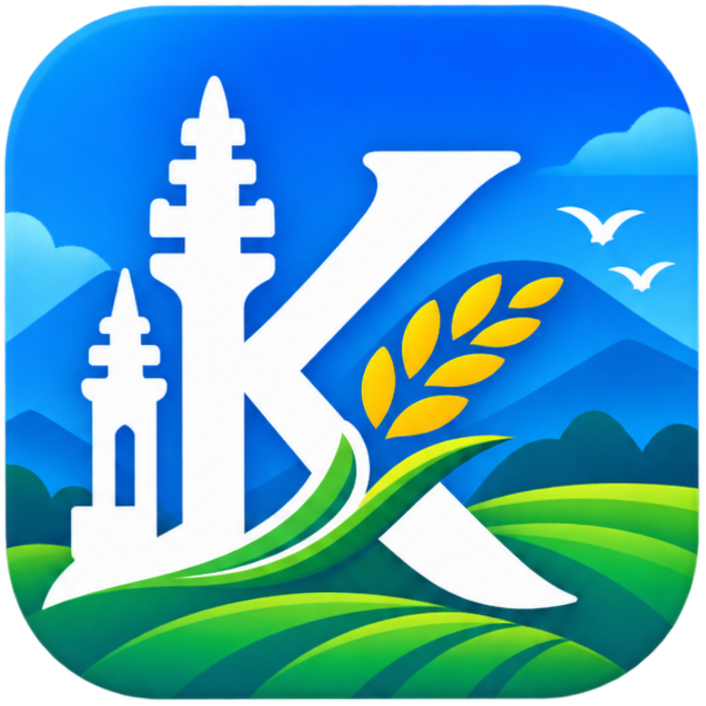

# Etalase Digital Desa Kuanyar



Platform digital untuk mempromosikan potensi Desa Kuanyar — UMKM, produk unggulan, wisata, budaya, agenda, galeri, dan berita.

[](https://react.dev)
[](https://www.typescriptlang.org)
[](https://vite.dev)
[](https://hono.dev)
[](https://drizzle.orm)
[](https://tailwindcss.com)
[](https://sqlite.org)
[](https://vercel.com)

---

## ✨ Fitur Utama

| Modul | Deskripsi |
|-------|-----------|
| **Beranda** | Hero, statistik, kategori potensi, UMKM unggulan, wisata populer, budaya, event terbaru, artikel terbaru, galeri |
| **Profil Desa** | Sejarah, visi misi, struktur organisasi, data demografi, peta wilayah (Leaflet) |
| **Potensi Desa** | Kategori potensi (pertanian, perikanan, UMKM, wisata, budaya) + detail per kategori |
| **UMKM** | Daftar UMKM dengan pencarian & filter kategori, detail UMKM (produk, lokasi, kontak) |
| **Produk** | Katalog produk UMKM dengan pencarian & filter, detail produk |
| **Wisata** | Daftar wisata dengan peta, galeri foto, fasilitas, detail lokasi |
| **Budaya** | Warisan budaya, jadwal kegiatan, lokasi |
| **Event/Agenda** | Kalender acara desa |
| **Galeri** | Foto & video dengan filter tipe (foto/video) & kategori |
| **Berita/Artikel** | Artikel dengan pencarian & filter kategori, detail artikel |
| **Kontak** | Form kontak, informasi kantor desa, peta lokasi |
| **Admin Panel** | CRUD lengkap untuk semua entitas + autentikasi JWT |

## 🛠 Stack Teknologi

**Frontend**
- React 19 + TypeScript
- Vite 8 (build & dev server)
- React Router v7 (routing + lazy loading)
- TanStack Query v5 (server state)
- Tailwind CSS v4 (styling)
- Leaflet + React Leaflet (peta interaktif)
- Lucide React (ikon)
- React Hook Form + Zod (form & validasi)
- React Helmet Async (SEO meta tags)

**Backend**
- Hono v4 (API server)
- Drizzle ORM + libSQL (SQLite/Turso)
- JWT authentication (admin)
- Oxlint (linting)

**Database**
- SQLite (development) / Turso/libSQL (production)
- Migrasi via Drizzle Kit

**Deployment**
- Vercel (static frontend + serverless API)
- Local development dengan Vite proxy ke Hono server

## 🚀 Quick Start

### Prasyarat
- Node.js 20+
- pnpm (recommended) / npm / yarn

### Instalasi

```bash
# Clone & install
git clone <repo-url>
cd etalase-digital-kuanyar
pnpm install

# Copy env & sesuaikan
cp .env.example .env

# Generate & jalankan migrasi database
pnpm db:generate
pnpm db:migrate

# (Opsional) Seed data development
pnpm seed

# Jalankan development (2 terminal)
# Terminal 1: API server
pnpm dev:server
# Terminal 2: Frontend dev server
pnpm dev
```

Frontend: `http://localhost:5173` (proxy `/api` → `localhost:4000`)  
API: `http://localhost:4000`  
Health check: `http://localhost:4000/health`

### Seed database

```bash
# Untuk production Turso: set TURSO_DATABASE_URL dan TURSO_AUTH_TOKEN
npm run seed
```

### Default admin

Email: admin@kuanyar.desa.id  
Password: admin123

## Scripts

| Command | Deskripsi |
|---------|-----------|
| `pnpm dev` or `npm run dev` | Frontend dev server (Vite) |
| `pnpm dev:server` or `npm run dev:server` | Backend API server (Hono + tsx) |
| `pnpm build` or `npm run build` | Build production (typecheck + Vite build) |
| `pnpm lint` or `npm run lint` | Lint dengan Oxlint |
| `pnpm preview` or `npm run preview` | Preview build production |
| `pnpm seed` or `npm run seed` | Seed database (Turso production atau local) |
| `pnpm db:generate` or `npm run db:generate` | Generate migrasi Drizzle |
| `pnpm db:migrate` or `npm run db:migrate` | Jalankan migrasi |
| `pnpm db:studio` or `npm run db:studio` | Buka Drizzle Studio (GUI database) |

## 🗂 Struktur Proyek

```
├── public/                 # Static assets
├── server/                 # Backend Hono API
│   ├── db/
│   │   ├── client.ts       # Drizzle + libSQL client
│   │   ├── schema.ts       # Schema database (11 tabel)
│   │   └── seed.ts         # Seeder data mock
│   ├── middleware/
│   │   ├── auth.ts         # JWT auth middleware
│   │   └── logger.ts       # Request logger
│   ├── routes/
│   │   ├── index.ts        # /api/etalase routes
│   │   └── catalog.ts      # /api routes (public + admin)
│   ├── services/
│   │   └── catalog.ts      # Business logic + CRUD
│   ├── data/
│   │   └── mockData.ts     # Data seed development
│   ├── index.ts            # App Hono utama
│   └── main.ts             # Entry point server
├── src/                    # Frontend React
│   ├── components/
│   │   ├── admin/          # Komponen admin panel
│   │   ├── cards/          # Card components (UMKM, Produk, dll)
│   │   ├── layout/         # Header, Footer, Navbar
│   │   ├── sections/       # Section components (Hero, Stats, dll)
│   │   └── ui/             # Base UI (Button, LoadingSkeleton, dll)
│   ├── contexts/
│   │   └── AuthContext.tsx # Auth state management
│   ├── hooks/              # Custom hooks (useApi, dll)
│   ├── layouts/
│   │   ├── MainLayout.tsx  # Layout publik
│   │   └── AdminLayout.tsx # Layout admin
│   ├── lib/
│   │   └── utils.ts        # Utility functions
│   ├── pages/              # Halaman (Home, UMKM, Wisata, Admin, dll)
│   ├── router.tsx          # Router config + lazy loading
│   ├── types/              # TypeScript types
│   ├── App.tsx             # Root app dengan providers
│   ├── main.tsx            # Entry point React
│   └── index.css           # Global styles + Tailwind
├── drizzle/                # Migrasi SQL (auto-generated)
├── .env.example            # Template env
├── vercel.json             # Config deploy Vercel
├── vite.config.ts          # Vite config + proxy API
├── drizzle.config.ts       # Drizzle Kit config
└── package.json
```

## 🔌 API Endpoints

### Publik (GET)

| Endpoint | Deskripsi |
|----------|-----------|
| `GET /api/kategori` | Daftar kategori |
| `GET /api/umkm` | List UMKM (`?search=&category=`) |
| `GET /api/umkm/:slug` | Detail UMKM |
| `GET /api/umkm/:slug/produk` | Produk milik UMKM |
| `GET /api/produk` | List produk (`?search=&category=`) |
| `GET /api/produk/:slug` | Detail produk |
| `GET /api/wisata` | List wisata (`?search=&category=`) |
| `GET /api/wisata/:slug` | Detail wisata |
| `GET /api/wisata/:slug/galeri` | Galeri wisata |
| `GET /api/budaya` | List budaya |
| `GET /api/budaya/:slug` | Detail budaya |
| `GET /api/event` | List event |
| `GET /api/event/:slug` | Detail event |
| `GET /api/galeri` | List galeri (`?type=&category=`) |
| `GET /api/galeri/:id` | Detail galeri |
| `GET /api/galeri-kategori` | Kategori galeri |
| `GET /api/artikel` | List artikel (`?search=&kategori=`) |
| `GET /api/artikel/:slug` | Detail artikel |
| `GET /api/artikel-kategori` | Kategori artikel |

### Admin (CRUD - butuh JWT)

| Method | Endpoint | Deskripsi |
|--------|----------|-----------|
| POST | `/api/auth/login` | Login admin (return JWT) |
| POST | `/api/admin/kategori` | Tambah kategori |
| DELETE | `/api/admin/kategori/:id` | Hapus kategori |
| POST | `/api/admin/umkm` | Tambah UMKM |
| PUT | `/api/admin/umkm/:id` | Update UMKM |
| DELETE | `/api/admin/umkm/:id` | Hapus UMKM |
| POST | `/api/admin/produk` | Tambah produk |
| PUT | `/api/admin/produk/:id` | Update produk |
| DELETE | `/api/admin/produk/:id` | Hapus produk |
| POST | `/api/admin/wisata` | Tambah wisata |
| PUT | `/api/admin/wisata/:id` | Update wisata |
| DELETE | `/api/admin/wisata/:id` | Hapus wisata |
| POST | `/api/admin/budaya` | Tambah budaya |
| PUT | `/api/admin/budaya/:id` | Update budaya |
| DELETE | `/api/admin/budaya/:id` | Hapus budaya |
| POST | `/api/admin/event` | Tambah event |
| PUT | `/api/admin/event/:id` | Update event |
| DELETE | `/api/admin/event/:id` | Hapus event |
| POST | `/api/admin/galeri` | Tambah galeri |
| PUT | `/api/admin/galeri/:id` | Update galeri |
| DELETE | `/api/admin/galeri/:id` | Hapus galeri |
| POST | `/api/admin/artikel` | Tambah artikel |
| PUT | `/api/admin/artikel/:id` | Update artikel |
| DELETE | `/api/admin/artikel/:id` | Hapus artikel |

**Autentikasi Admin**: Header `Authorization: Bearer <token>`  
Default admin: `email: admin@kuanyar.desa.id`, `password: admin123`

## 🗄 Database Schema

11 tabel utama:

| Tabel | Deskripsi |
|-------|-----------|
| `etalase` | Halaman/kategori utama (homepage sections) |
| `categories` | Kategori global |
| `umkms` | Data UMKM |
| `products` | Produk UMKM |
| `tourism` | Tempat wisata (dengan lat/lng, gallery JSON, facilities JSON) |
| `cultures` | Warisan budaya |
| `events` | Acara/agenda |
| `gallery` | Foto/video (type: image/video) |
| `articles` | Berita/artikel |
| `admins` | User admin (username, passwordHash) |
| `produk` | Legacy table (etalase products) |

## 🌍 Deployment

### Vercel (Recommended)

1. Push ke GitHub/GitLab/Bitbucket
2. Import project di Vercel
3. Set Environment Variables:
   - `TURSO_DATABASE_URL` (libSQL/Turso production URL)
   - `TURSO_AUTH_TOKEN` (Turso auth token)
   - `SITE_URL` (URL production, e.g. `https://etalase-kuanyar.vercel.app`)
4. Deploy

`vercel.json` sudah dikonfigurasi untuk:
- Static build output (Vite)
- API routes → `/api/*` (serverless functions)

### Manual (VPS/Server)

```bash
# Build
pnpm build

# Jalankan server production
NODE_ENV=production node server/main.ts  # butuh @hono/node-server
# Atau gunakan process manager (PM2, systemd)
```

## 🔧 Konfigurasi Environment

| Variable | Required | Default | Deskripsi |
|----------|----------|---------|-----------|
| `PORT` | No | `4000` | Port API server |
| `TURSO_DATABASE_URL` | Yes | `file:./sqlite.db` | Database URL (libSQL/Turso) |
| `TURSO_AUTH_TOKEN` | Production only | - | Auth token Turso |
| `VITE_API_BASE_URL` | No | `http://localhost:4000` | Base URL API untuk frontend |
| `SITE_URL` | No | - | URL canonical untuk SEO/OG |

## 📝 Development Notes

- **Lazy loading**: Semua halaman menggunakan `React.lazy` + `Suspense`
- **Path aliases**: `@/` → `src/`, `@/server` → `server/` (via `vite-tsconfig-paths`)
- **Type safety**: Zod schemas untuk validasi form & API response
- **SEO**: `react-helmet-async` per halaman untuk meta tags
- **Maps**: Leaflet (OSM tiles) untuk peta wisata & profil desa
- **Auth**: JWT sederhana (HS256), password plain di dev (hashing di roadmap)

## 🗺 Roadmap

- [ ] Password hashing (bcrypt/argon2) untuk admin
- [ ] Role-based access (superadmin, editor)
- [ ] Image upload (Supabase Storage / Cloudflare R2)
- [ ] PWA support (offline, install prompt)
- [ ] Unit/Integration tests (Vitest + Playwright)
- [ ] i18n (Indonesia/English/Jawa)
- [ ] Analytics (Plausible/Umami)
- [ ] Webhook notifikasi (WhatsApp/Email)

## 📄 License

MIT License — bebas digunakan untuk keperluan desa/komunitas.

## 🤝 Kontribusi

PR & issue welcome. Untuk perubahan besar, buka issue dulu untuk diskusi.

**Dibangun dengan ❤️ untuk Desa Kuanyar**